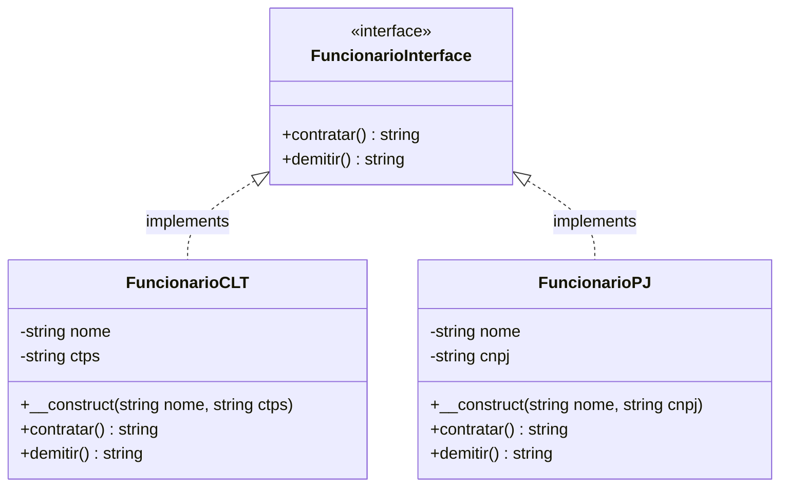

# Diagrama de Classes - Funcionários (Interface)

```mermaid
classDiagram
    class FuncionarioInterface {
        <<interface>>
        +contratar() string
        +demitir() string
    }

    class FuncionarioCLT {
        -string nome
        -string ctps
        +__construct(string nome, string ctps)
        +contratar() string
        +demitir() string
    }

    class FuncionarioPJ {
        -string nome
        -string cnpj
        +__construct(string nome, string cnpj)
        +contratar() string
        +demitir() string
    }

    FuncionarioInterface <|.. FuncionarioCLT : implements
    FuncionarioInterface <|.. FuncionarioPJ : implements
```